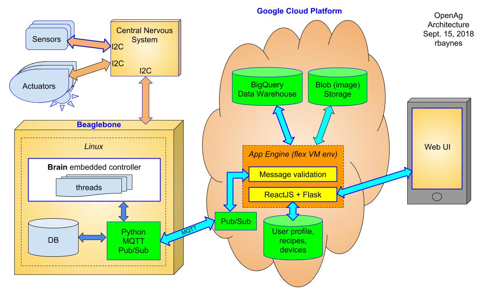

# Contributing

## General Resources
 - [Forum](https://forum.openag.media.mit.edu/)
 - [Wiki](https://wiki.openag.media.mit.edu/start)
 - [PFC EDU 3.0](https://wiki.openag.media.mit.edu/pfc_edu_3.0)

## Coding Practices Resources
 - [Zen of Python](https://www.python.org/dev/peps/pep-0020/)
 - [Clean Code Summary](http://www.inf.fu-berlin.de/inst/ag-se/teaching/K-CCD-2014/Clean-Code-summary.pdf)
 - [Code Style Guide (Black)](https://black.readthedocs.io/en/stable/the_black_code_style.html)
 - [Type Checking Intro](https://mypy.readthedocs.io/en/stable/introduction.html)

## IoT System Architecture

## Device System Architecture
 - TODO
