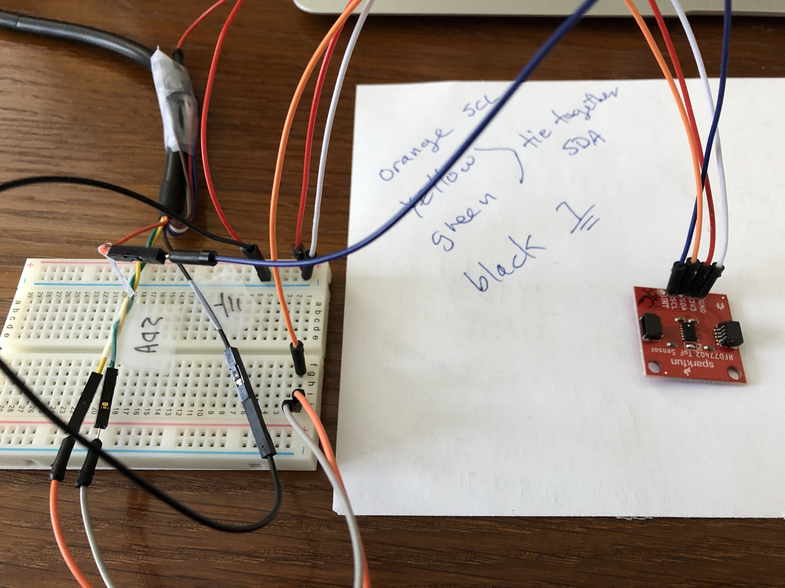
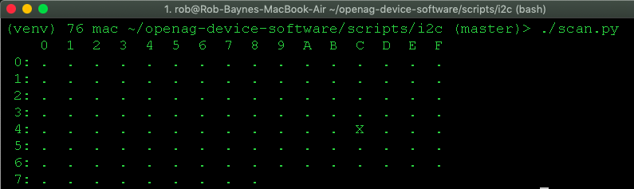
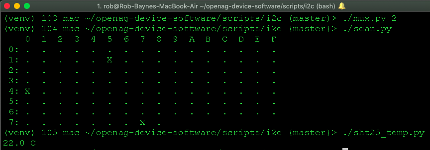

# USB to I2C connection

## Description
To connect a laptop or desktop to our hardware, you will need a special cable that converts a USB-2 port to the I2C communication protocol our boards and sensors / actuators use.

This is the cable we use, it works well with OSX and Linux/Ubuntu: [FTDI C232HM-DDHSL-0 USB I2C cable from DigiKey](https://www.digikey.com/short/pq3505)

Recent versions of OSX and Ubuntu have the drivers you need built in.

Here is the support that is built into OSX 10.14.3:
```bash
mac ~ > kextstat | grep -i ftdi
  196    0 0xffffff7f8604b000 0x3000     0x3000     com.apple.driver.AppleUSBFTDI (6.0.0) E7845CEE-2059-399E-95A1-E3D9C07E684B <195 85 23 6 5 3 1>

System Info app, Hardware > USB:
  C232HM-DDHSL-0:
    Product ID:                     0x6014
    Vendor ID:                      0x0403  
    Version:                        9.00
    Serial Number:                  FT2HDNH4
    Speed:                          Up to 480 Mb/sec
    Manufacturer:                   FTDI
    Location ID:                    0x14100000 / 12
    Current Available (mA):         500
    Current Required (mA):          500
    Extra Operating Current (mA):   0
```

## Installation
Since we use Python 3.6 for this appliation, the easiest way to communicate with the cable is this package:  [pyftdi](https://pypi.org/project/pyftdi/)

Our installation scripts handle setting up the pyftdi system dependencies for OSX and Linux/Ubuntu for you:  [libusb](http://eblot.github.io/pyftdi/installation.html)


## Wiring
See the [FTDI cable data sheet for the I2C pin out at the bottom of page 8](https://www.ftdichip.com/Support/Documents/DataSheets/Cables/DS_C232HM_MPSSE_CABLE.PDF).

This is the I2C pin out we use:


## Testing
Refer to the [pyftdi docs](http://eblot.github.io/pyftdi/api/i2c.html) for python help.

See the USB-I2C cable testing scripts in: `~/openag-device-software/scripts/i2c/*.py`

In this picture I am testing a [ToF distance sensor](https://github.com/sparkfun/Qwiic_Distance_RFD77402) that is at I2C address 0x4C.  When I connect the sensor to the cable I am able to scan the I2C bus and see the device at that address:




## Development
When we are developing our embedded applications and drivers, doing it on a tiny, slow microprocessor can be tedious.  This cable lets you directly connect any I2C device directly to your machine for ease of debugging.  You can also connect a more complex device that has (multiple) I2C busses, such as our PFC_EDU board v3.0.  

In the following picture, you can see that I removed the Beaglebone from my PFC_EDU and I connected the green + yellow SDA lines from the USB-I2C cable to the SDA header pin for the Beaglebone.  The orange SCL cable wire goes to the SCL pin and the black cable wire goes to a data ground pin, I used the upper right one in this case.

PFC_EDU v3.0 board connected via the USB-I2C cable to a macbook air:


Here is the I2C bus scan showing:
- The boards I2C multiplexer at address 0x77.
- The T6713 C02 sensor at multiplexer channel 2, address 0x15.
- The SHT25 temperature and humidity sensor at multiplexer channel 2, address 0x40.


On the PFC_EDU board, we use multiplexer channel 3, address 0x47 and 0x4C to
controll a DAC for the 6 color LEDs.  See the `leds.py` script to test them.


